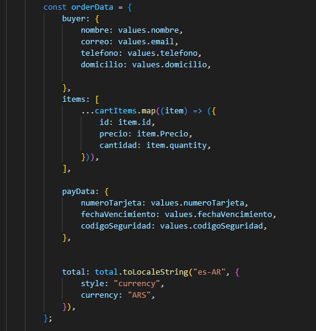

# ReactProyectCoderHouse

## Aplicación de eCommerce React + Vite

### Maurizio Abatantuno, estudiante de React.js en coderhouse. comision #47130.

## Características

- **Listado de Productos:** Muestra una lista de productos con detalles e imágenes.
- **Carrito de Compras:** Permite agregar y eliminar productos del carrito de compras.
- **Filtro por categorias:** Permite navegar por distintas categorias de productos.
- **Prosesa ordenes de compra:** Procesa pedidos que se reciben en la BD de FireStore.

## Tecnologías Utilizadas

- **React:** Una biblioteca de JavaScript para construir interfaces de usuario.
- **Vite:** Una herramienta de compilación rápida para aplicaciones React.
- **Firebase:** Una plataforma basada en la nube para construir aplicaciones web y móviles.
- **React-Bootstrap:**
Biblioteca de componentes para React.js
- **Formik:**
Biblioteca de componentes para Formularios.
- **SweetAlert2:**
Biblioteca para modales.

### Requisitos Previos

- Node.js y npm instalados en el proyecto.
- Proyecto Firebase configurado (con Firestore, Hosting y Firebase).

### Instalación
- **Instala dependencias:**

- **Realiza la configuración de Firebase:**
Asegúrate de configurar correctamente las credenciales de Firebase creando un archivo firebaseConfig.js en la raíz del proyecto con el siguiente contenido:

Reemplaza los valores con la configuración real de tu proyecto de Firebase.

- **Instala Firebase CLI:**

 

- **Inicia sesión en Firebase:**

## Uso de Formik para Formularios
### Instalación de Formik
Para utilizar Formik en tu proyecto, simplemente ejecuta el siguiente comando:

### Ejemplo de Uso
A continuación, se proporciona un ejemplo de cómo se utilizo Formik en un componente de formulario de este proyecto:

- **Importaciones:**

 ### Envio de datos con FireStore
- **acceso a la colección:**

- **Formato de datos que se envian del formulario de Formik:**

- **Acceder al formato creado de datos:** 
Dato importante: no olvidarse de la crear la referencia de datos.

- **Definir los valores iniciales:**
Abrimos la etiqueta de Formik y empezamos agregando los initialValues.

- **Validacion de errores:**
Aca debemos hacer las validaciones de nuestro formulario segun nuestras necesidades, dejo captura para que se vean las expresiones regulares de las que hice uso.

- **Evento del boton:**
Vacía el Cart y resetea el Form al enviar los datos.

- **Formulario**
Creamos el formulario con el formato que nos da Formik en su documentación.

### Renderizado: 
Se aplico una cart de Bootstrap para el renderizado de los productos que se agregaron a la orden de compra.

## Formato recibido en FireStore
En la coleccion creada en FireStor se reciben los datos de la siguiente forma:

- **Buyer:**

- **Items:**

- **PayData:**

